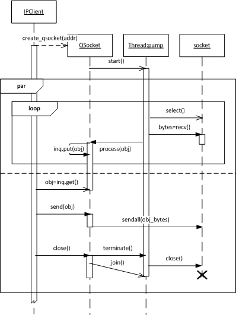
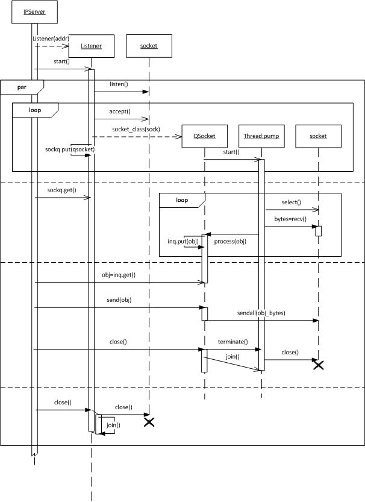

# qsocket

Queue-like Socket class - enables to send picklable object through a socket

## Rationale
When starting a new project I needed a way to write an asynchronous server. Asynchronous refers to the ability to send and receive messages at arbitrary times. Asynchronous servers are used to take action on random events, for example synchronizing distributed state, or sending orders to a trading venue when the orderbook changes. This concept is different from request-response and publish-subscribe. The Python Standard Library provides many templates for writing a request-response server (asynchat, http.server, xmlrpc.server) which do not apply in this case.

## Q & A

### Why not use [asyncio](https://docs.python.org/3/library/asyncio.html)?
Asyncio is not supported by all functions. My software uses urllib for querying web pages. As a workaround the urllib call has to started in a thread. Why not stick to threads anyway? Also the syntax is polluted by async and yield from statements.  

### Why use multiple threads?
Enables asynchronous send and receive. The main thread will call send directly. Receiving occurs anytime. The additional pump thread waits for inbound data, unpickles and pushes to a receiver queue for pickup by another thread. 

### Why use [select](https://docs.python.org/3/library/select.html) when receiving data? 
The Python Standard Library socket class is not thread safe. Calling a blocking recv will prohibit the use of send in another thread. That is why socket access is protected using the socket_access lock. The select call allows to wait for inbound data while not using the socket_access lock. 

### Why not use non-blocking calls?
Non-blocking calls require polling or using select. Extra handling is required if no data is available, or the send buffer is full. Using blocking calls makes program flow easier to handle (fewer timeout cases) and code more explicit. Since netstrings are used the data length is known.

### What is a netstring?
See at [https://en.wikipedia.org/wiki/Netstring](https://en.wikipedia.org/wiki/Netstring). QSocket encodes the data length in a 4 byte integer (see [struct](https://docs.python.org/3/library/struct.html)).

## Package contents

### Constants
    QSocket.PACK_FMT
	QSocket.PACK_SIZE
Determine the type used to encode the buffer length. The default is to use network endian integer ("!i")

	QSocket.SELECT_TIMEOUT
The timeout for the *select* call. The default timeout is 0.1 sec.

	Listener.ACCEPT_TIMEOUT
The timeout for the *accept* call. It is required to detect closing of the socket. The default timeout is 0.1 sec.

	qsocket.create_qsocket(addr)
Opens a connection to *addr* and instantiates a *QSocket* with it. *addr* is a 2-tuple (host, port).

### class QSocket

	class QSocket(sock)
The QSocket class encapsulates a [socket](https://docs.python.org/3/library/socket.html) for asynchronous sending and receiving of objects. *sock* is an open and connected socket. A *pump* thread is created and started to monitor for inbound data.

		send(obj)
Send an object. Only picklable object can be sent. 

		inq
The threadsafe inbound [queue](https://docs.python.org/3/library/queue.html) where received objects are stored. Any other thread can get objects from inq for processing.

		close()
Stop the receiver thread and close the socket.

		process(obj)
The *pump* thread calls *process* after receiving data and unpickling to an object. The default behaviour is to put the obj to the *inq*. Override *process* in a derived class to change the behaviour. 

		on_close()
The *pump* thread calls *on_close* after the socket has closed. The default behaviour is to put a None to the *inq*. Override *on_close* in a derived class to change the behaviour.

### class Listener

	class Listener(addr, socket_class=QSocket)
The Listener class waits for connection requests on *addr*. *addr* is a 2-tuple (host, port). When a socket is accepted, a *socket_class* instance is created with the new socket. If not provided a *QSocket* is instantiated. Listener is derived from Thread. 

		sockq
The threadsafe [queue](https://docs.python.org/3/library/queue.html) where newly created *socket_class* are stored. Any other thread can pickup the QSocket for processing.

		close()
Stop the acceptor thread and close the socket.

## UML

### Client

### Server
